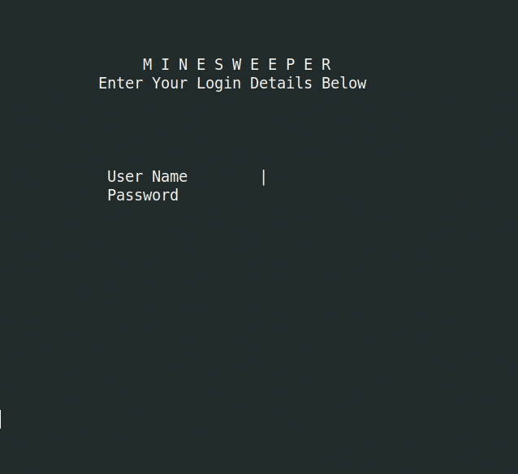
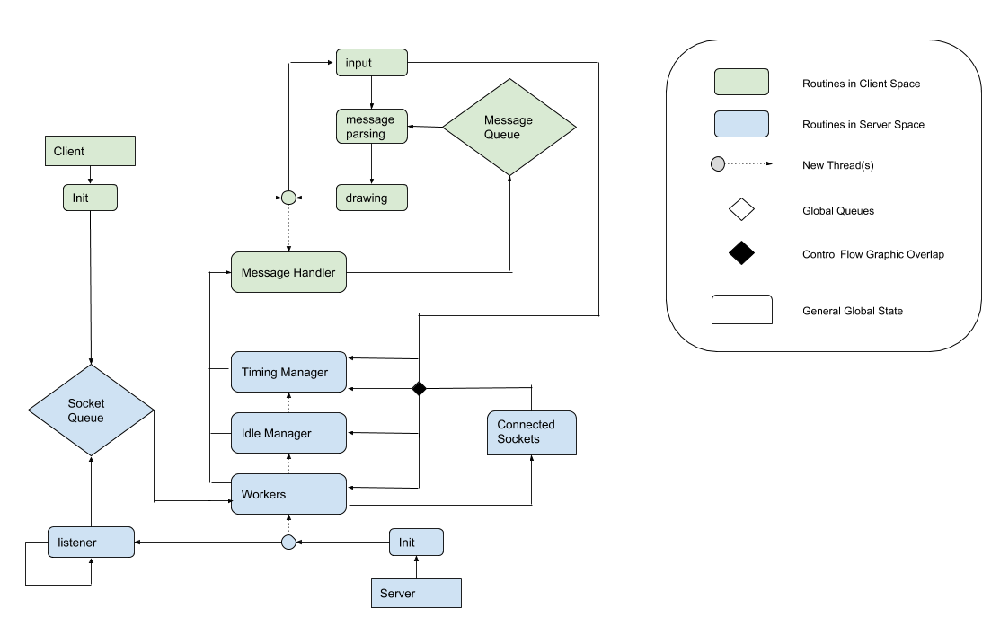

# Online Multithreaded Minesweeper

<div style="text-align:center"></div>

## How To Run
Building
```
./build.sh
```

Running the server
```bash
./server.exe
./server.exe <PORT>
```

Running the client
```bash
./client.exe
./client.exe <PORT>
```

The default user details are below, however if you wish to add more users simply see the **whitelist** file, [Authentication.txt](Authentication.txt).
```yaml
Username:  User
Password:  Password
```


## Background
This was an assignment for a class at the Quensland University of Technology on systems programming (CAB403). I had a lot of fun when I did this in the second semester of 2018, and so I thought I'd provide the repository publically as a resource for future students. _I imagine the assignment specification should have changed sufficiently, so it shouldn't be a problem if I post this._

You may notice, the game is not exactly implemented properly due to some _design limitations_, and there is a few things that you would need to add if you wanted to use this project as a base for something else, password hashing would be a good start ;) . The reason for this was the specification! Thus, I have attached the [specification I was given when working on this](spec.pdf). _Be warned I intentionally ignored some requirements._

The below includes snippets from the report that I thought might be nice for explanation.

----

## Preface
Due to the relative size of each program, a singular file was used in each case, thus client code can be found in client.c, and server code likewise in server.c. Common code and definitions across programs can be found in common.h. All basic types used in both programs are macros and are defined in type.h. These type macros are:

```c
#define u8      uint8_t
#define i8      int8_t
#define u16     uint16_t
#define i16     int16_t
#define u32     uint32_t
#define i32     int32_t
#define u64     uint64_t
#define i64     int64_t
#define f32     float
#define f64     double
```

## Program Design
<div style="text-align:center"></div>

### Client

Connecting to the server is done so simply by creating a socket and pointing it towards the specified or default port on localhost. This will then poll until a connection with the server has been established.

```c
for (u32 i = 0; i < NUM_CONNECT_RETRIES + 2; i++)
{
    if (i == NUM_CONNECT_RETRIES + 1)
    {
        printf("\r\nServer did not respond.\r\nAre you sure it is listening?\r\n");
        return -1;
    }
    else if (i > 0)
    {
        printf("[%u/%u] retrying connection\r\n", i, NUM_CONNECT_RETRIES);
    }

    ret_val = connect(server_sock, (struct sockaddr*) &send_addr, send_addr_size);
    if (ret_val == -1)
    {
        fflush(stdout);
        sleep(1);
    }
    else
    {
        break;
    }
}
```

As the client is a real-time operating program, drawing at 24Hz, a change was needed to alter the characteristics of the terminal to allow non-blocking keyboard input detection. To accomplish this, cfmakeraw() was used, which from the manual itself says, “_input is available character by character, echoing is disabled, and all special processing of terminal input and output characters is disabled._”

A message handler thread is created in-tandem with this process, and periodically polls the server socket with a blocking receive call. Messages received are then appended to the global client message queue. No data-structure was needed for this simple queue, and was hence implemented as a batch of strings in global space, with lengths defined in the common header. The default message length was determined by calculating the largest message sent, the leaderboard query. The default batch size was determined empirically based on response time. 

No dynamic memory was allocated in the client program.  

```c
while (1)
{
    // skip if queue is full
    if (message_idx >= QUEUE_BUFFERS) { continue; }

    // get message
    ret_val = recv(server_sock, msg, DEFAULT_MSG_LEN, 0);
    if (ret_val < 0) { continue; }
    if (msg[0] == 0) { continue; }

    // store it
    pthread_mutex_lock(&queue_mutex);
    for (u16 i = 0; i < DEFAULT_MSG_LEN; i++)
    {
        queue[message_idx][i] = msg[i];
    }
    message_idx++;
    pthread_mutex_unlock(&queue_mutex);
}
```

The general game loop for the client was then a series of responding to keyboard input, parsing buffered client messages, and displaying the appropriate screen based on the clients state. Timing is also handled, by retrieving the time before the keyboard interaction, and calculating the delta from the time retrieved after drawing.

```c

while (1)
{
    clock_gettime(CLOCK_MONOTONIC, &t0);
    
    // input + logic
    if (keyboard_hit())
    ...

    // parse message queue
    for (u8 i = 0; i < QUEUE_BUFFERS; i++)
    ...

    pthread_mutex_lock(&queue_mutex);
    message_idx = 0;
    pthread_mutex_unlock(&queue_mutex);

    // draw
    if (last_frame_time_milliseconds >= target_frame_time_milliseconds)
    {
        CLEAR_SCREEN();
        ...
        last_frame_time_milliseconds -= target_frame_time_milliseconds;
    }

    last_frame_time_milliseconds += frame_time_milliseconds;
    
    clock_gettime(CLOCK_MONOTONIC, &t1);
    time_diff(t0, t1, &dt);

    frame_time_milliseconds  = dt.tv_sec * 1000;
    frame_time_milliseconds += (f64)(dt.tv_nsec / MILLISECONDS); 
}
```

### Server
The socket queue used in the server is a batch-wise dynamically allocated buffer contained within a structure. It contains a batch index to indicate the currently allocated number of batches, and standard index for storing new elements within a given batch via queue_push(). A dynamic implementation was chosen as in the given context it appeared as though the number of clients concurrently handled would be fairly low, thus a large statically allocated queue would not be needed.

The server initializes in a similar way to the client, albeit with no need for interfacing code related to the terminal. A listener socket is created, along with a dedicated idle managing thread, timing thread and as many workers are specified in the thread pool.

- The listener thread “listens” for new connections and appends those client sockets to a queue designed for sockets. (main thread)
- The idle managing thread sends message to connections in the socket queue containing the position in the queue they are so that information can be displayed to the user in the client.
- The time managing thread sends messages to connections that are actively being served, if the respective timer flag is set. These messages contain the time spent playing a given game.
- The worker threads are contained within a buffer or “pool”, and handle the interactions with the client, and are implemented in a polling structure. The worker sub-routine is responsible for the largest portion of complexity in the server, and thus it is worth discussing further. The main loop for workers are as follows:

1. Various client state variables and game state variables are created.

2. The worker polls for client acquisition from the queue, and responds to the client if connected.
    ```c
    // client aquisition
    i32 client_sock = DEFAULT_SOCKET;
    while(client_sock == DEFAULT_SOCKET)
    {
        thread_actives[thread_idx] = queue_pop();
        client_sock = thread_actives[thread_idx];
        if (client_sock != DEFAULT_SOCKET)
        {
            // tell client they are being served
            ret_val = send(client_sock, msg, DEFAULT_MSG_LEN, MSG_NOSIGNAL);
            if (ret_val < 0) { break; }
            else
            {
                DEBUG_MESSAGE(SENT, ret_val, msg);
                for (u8 i = 0; i < LEN_TYPE_CON; i++) { msg[i] = 0; }
            }
        }
        sleep(1);
    }
    ```

3. The worker polls for client interaction, and parses messages as they are received and responds immediately.
    ```c
    // client message handling
    WORKER(thread_idx, "Client attached: %d\n", client_sock);
    while (1)
    {
        ret_val = recv(client_sock, msg, DEFAULT_MSG_LEN, 0);
        if (ret_val <= 0) { break; }
        else
        {
            DEBUG_MESSAGE(RECV, ret_val, msg);

            if (parse_header(&msg_pointer, MESSAGE_TYPE_LOGIN, LEN_TYPE_LOGIN))
            else if (parse_header(&msg_pointer, MESSAGE_TYPE_START, LEN_TYPE_START))
            else if (parse_header(&msg_pointer, MESSAGE_TYPE_STOP, LEN_TYPE_STOP))
            else if (parse_header(&msg_pointer, MESSAGE_TYPE_REV, LEN_TYPE_REV))
            else if (parse_header(&msg_pointer, MESSAGE_TYPE_FLAG, LEN_TYPE_FLAG))
            else if (parse_header(&msg_pointer, MESSAGE_TYPE_LEAD_P, LEN_TYPE_LEAD_P))
            else

            // done parsing - reset pointer
            msg_pointer = msg;
        }
    }
    ```

4. Upon a break from the interaction poll, the client will need to be released and variables will need to be reset. By design however, most variables are stored on the stack, and thus will simply get reset on the next iteration of the main loop, reducing overall code. When releasing the client, checks are made to ensure that the authentication data structure is aware of the user disconnecting. Thread globals are then reset, referring to the “connected sockets” depiction in the diagram above. 
    ```c
    // client release
    if (auth_status == AUTH_SUCC)
    {
        pthread_mutex_lock(&auth_mutex);
        database.in_use[authentication_id] = 0;
        pthread_mutex_unlock(&auth_mutex);
    }

    thread_actives[thread_idx] = DEFAULT_SOCKET;

    pthread_mutex_lock(&time_mutex);
    thread_timers[thread_idx] = TIMER_OFF;
    pthread_mutex_unlock(&time_mutex);

    close(client_sock);
    WORKER(thread_idx, "Client disconnected\n");
    ```

In both the client and the server messages are sent over the socket. The implementation of these messages is based on two use cases: production and debugging. A statically determined message size is used to reduce complexity, with a size mentioned above. Defined in [common.h](src/common.h) are 4 types of variables regarding messages, all under the same design pattern. Messages are split into headers (defined as a **TYPE**) and body contents (defined as **DATA**), to allow for performance when dealing with small messages at parse time. The pattern used is a static message, followed by a length specification. 

For example, using a generalized snippet of the current state of the code, one might think the length redundant if the number of messages is less than 256, the number of values in a byte.  
```c
#define LEN_TYPE_LOGIN              1
#define LEN_TYPE_ACC                1

static const u8 MESSAGE_TYPE_LOGIN  [] = "a";
static const u8 MESSAGE_TYPE_ACC    [] = "b";
```

The value in this comes at debug time, where given an issue regarding a particular message, one can alter the message type to be in a more human readable form.
```c
#define LEN_TYPE_LOGIN              5
#define LEN_TYPE_ACC                8

static const u8 MESSAGE_TYPE_LOGIN  [] = "login";
static const u8 MESSAGE_TYPE_ACC    [] = "accepted";
```
